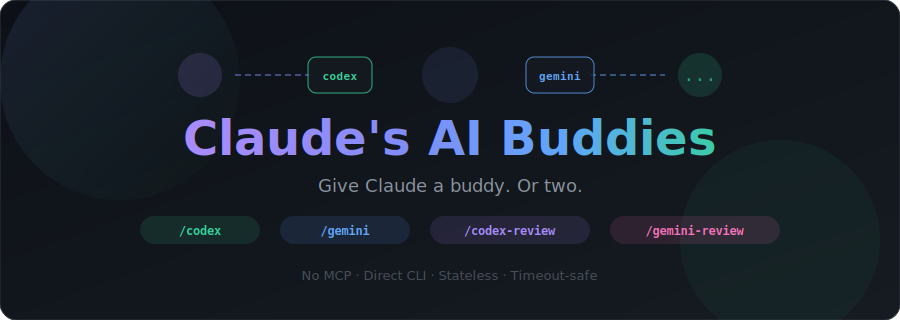

<div align="center">



[](LICENSE)
[](#-testing)
[](https://github.com/cukas/claude-plugins)

*Three AI engines. One codebase. They compete, you ship.*

</div>

---

## The Idea

What if three AI engines could compete on the same coding task — and only the best implementation wins?

**AI Buddies** connects Claude Code to peer AI CLIs. Run **confidence bids** to pick who handles a task, get cross-model **code reviews**, or launch a **forge** where all three engines independently build, test, and refine the same solution.

```
/brainstorm "task"  →  Three AIs bid confidence  →  You pick who builds it
/forge "task"       →  Three AIs build in parallel  →  Fitness tests decide the winner
```

> Install only the engines you want. Works with just Codex, just Gemini, or both.

---

## Forge — the flagship feature

*Forge started as a `/brainstorm` session. Claude, Codex, and Gemini designed the concept together — the name, the architecture, the staged escalation model. The feature they planned is built by the three engines that imagined it.*

Three AI engines independently implement the same task in isolated git worktrees. A staged pipeline — starter, challengers, critique-based synthesis — ensures the best solution wins. Claude orchestrates but never competes.

```
/forge "Add input validation to math utils" --fitness "node src/math.test.js"
```

```
## Forge Scoreboard: Add input validation

| | Claude | Codex | Gemini |
|---|---|---|---|
| Fitness | FAIL | PASS | PASS |
| Score | 0/100 | 82/100 | 89/100 |
| Duration | 4s | 12s | 8s |
| Files changed | 1 | 1 | 1 |
| Diff size | 33 lines | 41 lines | 27 lines |
| Lint warnings | 2 | 0 | 0 |
| Style score | 85/100 | 95/100 | 100/100 |

Winner: Gemini — score 89/100.
```

**How it works:**

1. **Context** — detects languages, conventions (ESLint, Ruff, etc.), and candidate files from the task description. Lightweight and task-scoped — no bloated project dumps
2. **Stage 1: Starter** — one engine runs first. If it scores >= 88 with clean lint and style, it's auto-accepted. No need to burn tokens on challengers
3. **Stage 2: Challengers** — if the starter doesn't clear the bar, remaining engines run in parallel. All scored with composite fitness
4. **Stage 3: Synthesis** — on close calls (spread < 8 points), losers send targeted critique hunks. The winner refines selectively. Only kept if the score improves
5. **Scoreboard** — composite scores (diff size 30%, lint 15%, style 15%, files 10%, duration 5%, test pass 25%). Close calls flagged
6. **Converge** — you approve the winning diff before it touches your working tree

**Features:**
- **`--async`** — run engines in background, continue your conversation
- **Speculative tests** — omit `--fitness` and engines propose test suites. Trust boundary validates commands before execution
- **Composite scoring** — linters (ESLint, Ruff, ShellCheck, Clippy) + style checks + diff analysis = objective 0-100 score
- **Baseline preflight** — warns if fitness passes on untouched code (non-discriminating test)
- **Graceful degradation** — works with 3, 2, or 1 engine. Timeouts don't block the forge

**Why this works:**
- **Three different training sets** = three different approaches to the same problem. Blind spots cancel out
- **Fitness tests, not vibes** — automated composite scoring means the best code wins, not the most confident pitch
- **Engines self-correct** — each gets up to 600s to implement, test, fix, and iterate. No artificial time pressure
- **Claude stays honest** — as pure orchestrator, Claude judges but never competes. No bias toward its own code

---

## Using Forge in Your Planning Workflow

`/forge` isn't a separate planner — it plugs into your existing workflow (`/build-guard`, plan mode, or any task list). Tag tricky tasks with `[forge]` during planning:

```
## Plan: Add retry logic to sidecar connection

1. Add RetryConfig type to shared types
2. [forge] Implement exponential backoff with jitter algorithm
3. Wire retry config into python-manager.ts
4. [forge] Add circuit breaker pattern for repeated failures
5. Add retry status to UI connection indicator
```

Claude handles the straightforward tasks directly. `[forge]` tasks trigger three-way competition. Best of both worlds.

**What to forge:** Algorithms, scoring logic, race condition fixes, performance-critical code — anything where three perspectives beat one.

**What NOT to forge:** Types, imports, config, UI layout — things with one obvious answer.

---

## Confidence Bid


```
/brainstorm "Fix the race condition in the WebSocket reconnection handler"
```

Each engine assesses the task honestly. Claude calibrates the scores and recommends who should take it.

```
| | Claude (Anthropic) | Codex (OpenAI) | Gemini (Google) |
|---|---|---|---|
| Confidence | 85% | 70% | 60% |
| Approach | Trace reconnect flow, | Add mutex lock on | Use exponential backoff |
| | find state leak | shared connection | with jitter |
| Risks | Might miss edge case | Could deadlock if | Doesn't fix root cause, |
| | in retry logic | not scoped right | just masks it |

Recommendation: Claude — highest confidence, already knows the codebase
```

**Why this works:**
- **Other engines burn their tokens, not yours** — heavy thinking offloaded to Codex/Gemini on their API bills
- **Claude calibrates the bids** — adjusts inflated/deflated scores based on actual approach quality
- **Three training sets catch blind spots** — disagreements are the most valuable signal

---

## Quick Start

```bash
# 1. Install the engines you want (one or both)
npm install -g @openai/codex        # OpenAI Codex
npm install -g @google/gemini-cli   # Google Gemini

# 2. Authenticate
codex auth login                    # uses your OpenAI account
gemini auth login                   # uses your Google account

# 3. Add the marketplace & install
claude plugin marketplace add cukas/claudes-ai-buddies
claude plugin install claudes-ai-buddies@cukas

# Done — start a new Claude Code session
```

Start a new session and you'll see:

```
[AI Buddies] Ready — Codex codex-cli 0.101.0 (gpt-5.4-codex) Gemini 0.32.1 (gemini-2.5-pro)
Available: /codex, /codex-review, /gemini, /gemini-review, /brainstorm, /forge
```

---

## All Skills

| Command | Engines | What it does |
|---------|---------|-------------|
| `/forge "task" --fitness "cmd"` | All available | Three-way build competition with automated fitness scoring |
| `/brainstorm "task"` | All available | Confidence bid — each AI rates the task, you pick who builds it |
| `/codex "prompt"` | Codex | Ask Codex anything — delegate, brainstorm, second opinion |
| `/gemini "prompt"` | Gemini | Ask Gemini anything — different model, different perspective |
| `/codex-review` | Codex | Code review via Codex (uncommitted, branch, or commit) |
| `/gemini-review` | Gemini | Code review via Gemini (uncommitted, branch, or commit) |
| `/buddy-help` | — | Full reference, config, troubleshooting |

---

## Examples

**Forge a tricky algorithm:**
```
/forge "Implement exponential backoff with jitter" --fitness "npm test"
```

**Confidence bid — who should take this?**
```
/brainstorm "Implement OAuth2 PKCE flow for our React Native app"
```

**Delegate to Codex:**
```
/codex "What's the best way to implement a rate limiter in Go?"
```

**Get Gemini's take:**
```
/gemini "Debug this: TypeError: Cannot read property 'map' of undefined"
```

**Code review uncommitted changes:**
```
/codex-review
/gemini-review
```

**Review a branch diff with focus:**
```
/codex-review branch:main "focus on security and SQL injection"
```

---

## How It Works

```
┌──────────┐     ┌──────────────┐     ┌─────────────┐     ┌──────────────┐
│   User   │────>│  Claude Code  │────>│  Wrapper.sh  │────>│  Peer AI CLI  │
│          │     │  (orchestrator│     │  (timeout,   │     │  (codex exec  │
│          │<────│   + judge)    │<────│   capture)   │<────│   gemini -p)  │
└──────────┘     └──────────────┘     └─────────────┘     └──────────────┘
                  reads output file    writes to temp file   runs headless
```

**For `/forge`**, each engine gets its own isolated git worktree:
```
/tmp/ai-buddies-session/forge-1234/
├── wt-claude/   ← Claude implements here
├── wt-codex/    ← Codex implements here (via codex exec --full-auto)
├── wt-gemini/   ← Gemini implements here (via gemini --yolo)
├── claude-patch.diff
├── codex-patch.diff
└── gemini-patch.diff
```

- **No MCP servers** — direct CLI subprocess calls
- **No API keys in transit** — each engine uses its own auth
- **Parallel execution** — engines run simultaneously
- **Timeout-safe** — 600s safety cap, engines self-exit when done
- **Always cleans up** — detached worktrees, no branch leaks

---

## Configuration

Optional — works out of the box. Config at `~/.claudes-ai-buddies/config.json`:

```json
{
  "codex_model": "gpt-5.4-codex",
  "gemini_model": "gemini-3.0-pro",
  "timeout": "120",
  "sandbox": "full-auto",
  "debug": "false"
}
```

| Key | Default | Description |
|-----|---------|-------------|
| `codex_model` | *CLI default* | Codex model override |
| `gemini_model` | *CLI default* | Gemini model override |
| `timeout` | `120` | Max seconds per call (forge uses its own 600s default) |
| `sandbox` | `full-auto` | `full-auto` or `suggest` |
| `codex_path` | *auto-detected* | Explicit codex binary path |
| `gemini_path` | *auto-detected* | Explicit gemini binary path |
| `debug` | `false` | Enable debug logging |

> Models are optional. When not set, each CLI uses its own latest default.

---

## Testing

```bash
bash tests/run-tests.sh
```

```
=== claudes-ai-buddies test suite ===
  ...
=== Results: 140/140 passed, 0 failed ===
```

---

## Part of the cukas Plugin Ecosystem

| Plugin | Description |
|--------|-------------|
| [**Remembrall**](https://github.com/cukas/remembrall) | Never lose work to context limits |
| [**Patrol**](https://github.com/cukas/patrol) | ESLint for Claude Code |
| **AI Buddies** | You are here |

All available via the [claude-plugins](https://github.com/cukas/claude-plugins) monorepo.

---

MIT License
